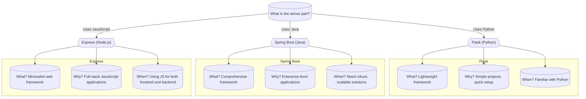

# Understanding the Server Part in Web Development Frameworks

#### What is a Server in Web Development?

- In web development, a **server** refers to software and hardware that accept and respond to requests made over a network. 
- In the context of Flask, Spring Boot, and Express, the server part specifically refers to software that listens for web requests (like when someone visits a web page) and sends back responses (like the content of the web page or data).

#### Why is the Server Part Important?

The server part is crucial because it:
- **Handles Requests**: It receives requests from users' browsers (like when someone clicks a link or submits a form).
- **Processes Data**: It can retrieve or save data to a database based on user interactions.
- **Sends Responses**: It sends data back to the browser, which can be a complete webpage, an update to part of a page, or just data (like in APIs).

#### When to Use Flask, Spring Boot, or Express?

Choosing between Flask, Spring Boot, and Express depends on several factors:

1. **Language Familiarity**:
   - **Flask**: Use if you are familiar with Python or are interested in a straightforward, lightweight approach to making web applications.
   - **Spring Boot**: Choose if you are using Java and need robust, enterprise-level features right out of the box.
   - **Express**: Ideal if you are comfortable with JavaScript and want to work in a Node.js environment, allowing you to use JavaScript on both the server and client sides.

2. **Project Requirements**:
   - **Simple Projects and Learning**: Flask is great for simple projects and learning the basics of web server operations due to its simplicity and minimal setup.
   - **Large Scale and Enterprise Applications**: Spring Boot is suited for larger applications with complex requirements, such as microservices architecture or extensive data handling.
   - **Full-Stack JavaScript Development**: Express is perfect if you aim to use JavaScript across the entire stack, simplifying development by using a single language throughout.

| Language   | Pros                                                                                             | Cons                                                                                           |
|------------|--------------------------------------------------------------------------------------------------|------------------------------------------------------------------------------------------------|
| JavaScript | - Unified Language Stack - Asynchronous Nature - Vast Ecosystem - Community Support      | - Callback Hell - Performance Limitations (CPU-bound tasks) - Immaturity of some libraries|
| Java       | - Performance and Scalability - Robust Ecosystem - Strong Typing - Multithreading        | - Verbose Syntax - Slower Time to Market - Memory Consumption                            |
| Python     | - Readability and Simplicity - Versatility - Rich Libraries - Rapid Development          | - Speed Limitations - Concurrency Weaknesses (GIL) - Memory Consumption                   |

## Javascript and Node.js

**Node.js** is a **JavaScript runtime environment** built on Chrome’s **V8 engine**. It lets you run JavaScript **outside of the browser** — like on a server.

### ✨ Why is this a big deal?
Before Node.js:
- JavaScript was only for browsers (frontend)
- Backend was written in languages like PHP, Python, Java

With Node.js:
- JavaScript is now **full stack** (frontend + backend)
- You can build everything in **one language**
- Is it Installed? `node -v` or `node --version`

---

## Why Use JavaScript for Both Frontend and Backend?

| 🔧 Feature             | 💡 Benefit                                                                 |
|------------------------|---------------------------------------------------------------------------|
| One Language           | Write both frontend and backend in JavaScript                            |
| Shared Models          | Use the same data validation or objects in both layers                   |
| Easier Hiring          | Teams can specialize in JavaScript across the board                      |
| Ecosystem              | Use npm packages for both frontend and backend                           |
| Faster Development     | No need to switch languages when building features                       |
| Great for SPA + API    | Ideal for Single Page Applications with a RESTful or GraphQL backend     |

---

## 🌟 Real Full Stack Tools in JavaScript

| Tool               | Use Case              |
|--------------------|------------------------|
| **Express**        | Backend framework      |
| **MongoDB + Mongoose** | NoSQL database         |
| **React / Vue / Angular** | Frontend frameworks |
| **Node + NPM**     | Server + packages       |
| **Next.js**        | Full-stack React        |
| **Socket.IO**      | Real-time communication |

---

Combining the simplified introductions to Flask and Spring Boot with the Express tutorial, here's a comprehensive and beginner-friendly guide that introduces backend web development across three popular programming languages: JavaScript (using Express), Python (using Flask), and Java (using Spring Boot). This guide is designed to make the concepts accessible to beginners who are just getting started with programming.

---

### Beginner's Guide to Backend Web Development

#### Introduction to Backend Web Development

When building web applications, the "backend" refers to the server-side, where all the data processing happens. You can use different programming languages like JavaScript, Python, and Java for backend development. Each language has frameworks that simplify the creation and management of web applications.

#### JavaScript: Using Express

**Express** is a framework for Node.js, making it easier to build web applications and APIs with JavaScript.

- **How Express Works**: Think of Express as a lightweight helper that allows you to handle requests and responses easily.
- **Setting Up a Basic Express Server**:
  1. **Initialize a Project**: Set up your Node.js project and install Express.
  2. **Create a Server**: Write a simple server that can send back responses to web requests.
  3. **Run the Server**: Start your server and it will listen for incoming requests.

#### Python: Using Flask

**Flask** is a micro-framework for Python. It's very beginner-friendly and great for small to medium web applications.

- **How Flask Works**: Flask handles web requests and makes it easy to send back web pages or data.
- **Creating a Basic Flask Application**:
  1. **Install Flask**: Use `pip` to install Flask.
  2. **Write Your App**: Create a small script that defines what happens when users visit different parts of your site.
  3. **Run Your App**: Start Flask and your web application will go live.

#### Java: Using Spring Boot

**Spring Boot** allows you to create robust web applications with Java. It is a bit more complex but very powerful for handling big projects.

- **How Spring Boot Works**: It provides a large number of ready-to-use features, minimizing manual setup.
- **Creating a Basic Spring Boot Application**:
  1. **Setup Your Project**: Use Spring Initializr to prepare your project setup.
  2. **Write Your App**: Add Java code to handle web requests.
  3. **Run Your App**: Launch your application with Spring Boot handling the heavy lifting.

### Why Learn Multiple Frameworks?

- **Broad Skills**: Understanding different technologies gives you flexibility in your projects or job opportunities.
- **Unified Concept, Diverse Implementation**: While each framework has its own way of doing things, the core ideas remain the same. Learning multiple frameworks shows you different approaches to solving similar problems.

### Getting Started

For each framework, you typically:
- **Set up your environment**: Install the necessary software and create a new project.
- **Write a basic application**: Define how your app responds to user requests.
- **Run your application**: Start your server and access your app through a web browser.

### Next Steps

In future courses, you'll explore more advanced features of these frameworks. You'll learn about connecting to databases, managing user sessions, and building complex routes and APIs.

---

This guide provides a foundation in backend web development across different technologies, tailored for absolute beginners. It’s structured to build confidence in handling server-side code and to pave the way for more advanced studies in web development.

---

