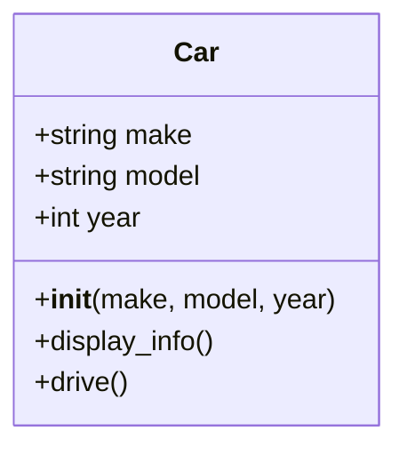
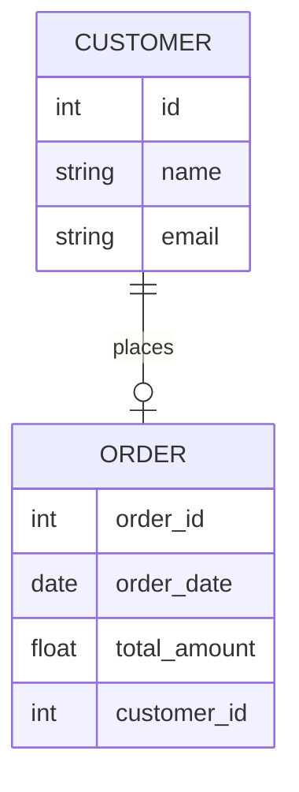

```mermaid
classDiagram
    class Car {
        +string make
        +string model
        +int year
        +__init__(make, model, year)
        +display_info()
        +drive()
    }
```

```mermaid
erDiagram
    CUSTOMER {
        int id
        string name
        string email
    }
    ORDER {
        int order_id
        date order_date
        float total_amount
        int customer_id
    }
    CUSTOMER ||--o| ORDER: places
```
